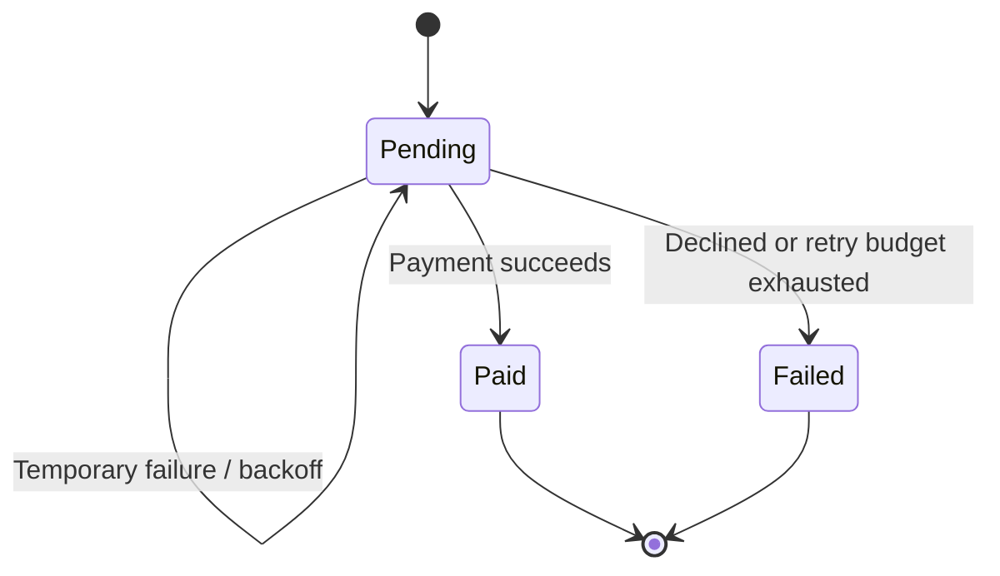

# Architecture and consistency boundaries

## Order acceptance

An HTTP request is validated by Fastify. Inside one database transaction, the API locks the idempotency key, checks its canonical request hash, locks each SKU in sorted order, reserves stock, and writes the order, items, key, audit event, and outbox event. Any error rolls everything back.

The HTTP response is outside that transaction. If the connection drops after commit, a retry with the same key discovers the committed order. If it drops before commit, the database rolls back and a retry creates the order. Hashing sorts line items and normalizes the default payment mode, so equivalent requests have the same fingerprint.

## Worker transaction

Workers select one eligible event with `FOR UPDATE OF e SKIP LOCKED`. The row lock lasts for the entire transaction. Other workers skip that event rather than double-processing it.

On success, a receipt, paid state, completed event, and audit entry commit together. On provider failure, the worker records the attempt and next due time. A permanent failure or exhausted retry budget commits the dead state, failed order, audit entry, and inventory compensation together. SQL failures escape the retry handler and roll back the whole transaction.

## Failure scenarios

| Failure | Result |
| --- | --- |
| Two orders contend for last unit | Product row lock serializes reservation; one returns 409 |
| Concurrent retries share a key | Advisory lock serializes requests; one order/event/reservation |
| An item is missing after an earlier reservation | Entire transaction rolls back |
| API stops after commit before response | Retry reads the committed order |
| Worker stops before commit | PostgreSQL rolls back; event remains pending |
| Provider temporarily unavailable | Event gets a due time with backoff and jitter |
| Provider permanently declines | Dead letter plus failed order and restored inventory |
| Database fails after simulated payment | Transaction rolls back; stable simulated reference supports replay |

## Delivery semantics

This is not a claim of exactly-once external payment execution. Database changes are transactional; external side effects require their own idempotency guarantees. The deterministic simulator uses the order ID for its reference. For a real provider, use a stable payment idempotency key and reconcile ambiguous outcomes before declaring failure or releasing stock.

## Scale and trade-offs

The API and workers can scale independently. PostgreSQL owns inventory, state, and work durability. Redis only shares rate-limit counters. Polling adds database traffic and up to one idle polling interval of latency. One transaction per event favors clarity and bounded demo workloads over maximum throughput.

Rates, pool sizes, SKU contention, and throughput have not been benchmarked. No performance claims are made. Long-running external calls must not be substituted into the simulated worker without redesigning claim leases and payment reconciliation.
